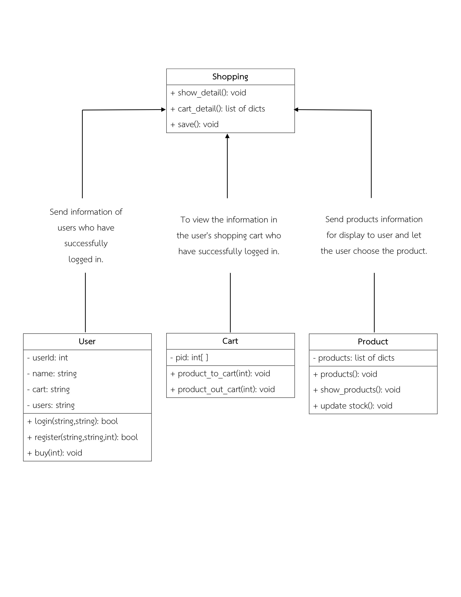

## Requirement


* Install Python language version 3.x
* No external libraries are installed, so can be run without additional libraries installed.

## UML Diagram




## Classes

Describes the functionality of the class.
1. **class User** :  Register or Authentication 

2. **class Product** :Fetch product details from file Dataset/Products.json for display purposes Including processing in the next class.

3. **class CartAction** : Import/export products (books) within the cart.

4. **class Shopping** : An intermediary is used to exchange data in each class. and can display products in the cart. Including saving data to a file.


## File database

Detailed information and usage.


### 1. Products.json

Store all information of products (books) include ID of the book, name, price and  stock.

```json
 
{
        "id": 1,
        "name": "Atomic Habbit",
        "price": 790,
        "stock": 17
    },
    {
        "id": 2,
        "name": "The magic of thinking big",
        "price": 350,
        "stock": 13
    }
}

```

#### Condition

1. Product id <span style="color:red">Do not duplicate</span>
2. In case of wanting to add/delete products, edit within the file. Products.json.

### 2. Users.json

Collect information for Login, Register and products in the cart.

```json
[   
  {
    "id": 1,
    "name": "user1",
    "username": "user1",
    "password": "1234",
    "cart": [1,2,1,5,2,2,2,3,1,1,1,1,5,2,3,3,1,5] 
  },
  {
    "id": 2,
    "name": "user2",
    "username": "user2",
    "password": "1234",
    "cart": [1,1,1,5,2]
  }
]
```

#### Condition
1. Member id <span style="color:red">Do not duplicate</span>
2. If wanting to add/delete members, edit within the Users.json file.
